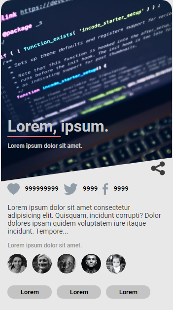
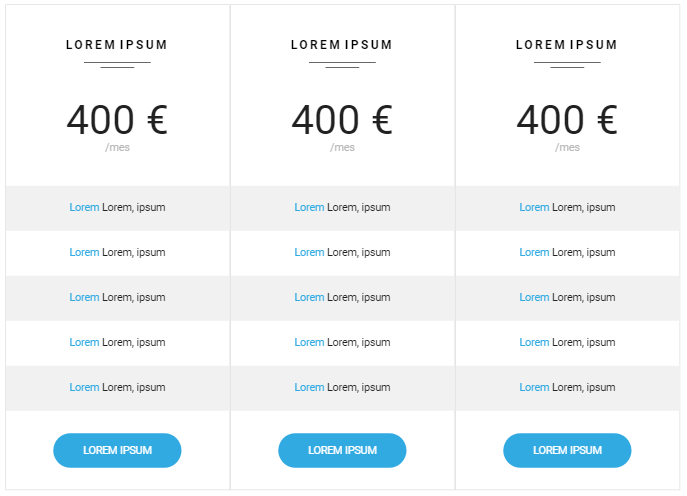

Complemento 01
=====================
<a href="https://cranky-bhabha-b0d6c6.netlify.app/index.html">Web desde netlify</a> 

Complmento 02
================
<a href="https://cranky-bhabha-b0d6c6.netlify.app/indexComplemento_02.html">Web desde netlify</a> 

# Plantilla FrontEnd
##### Plantilla Básica para poder empezar casi cualquier proyecto en **FrontEnd**.

~~~
Metodología de carpetas en FrontEnd
Estructura en imágenes (svg, jpg, iconos, etc)
Readme, licencia MIT, gitignore
Fuentes externas al OS
Semiestructuras en código
Comentarios introductorios
~~~

> Este contenido se ha creado para mís alumnos, que se inician en el maravilloso mundo de la programación.

---
###### _Copyright 2020 - Toni Ferra_

